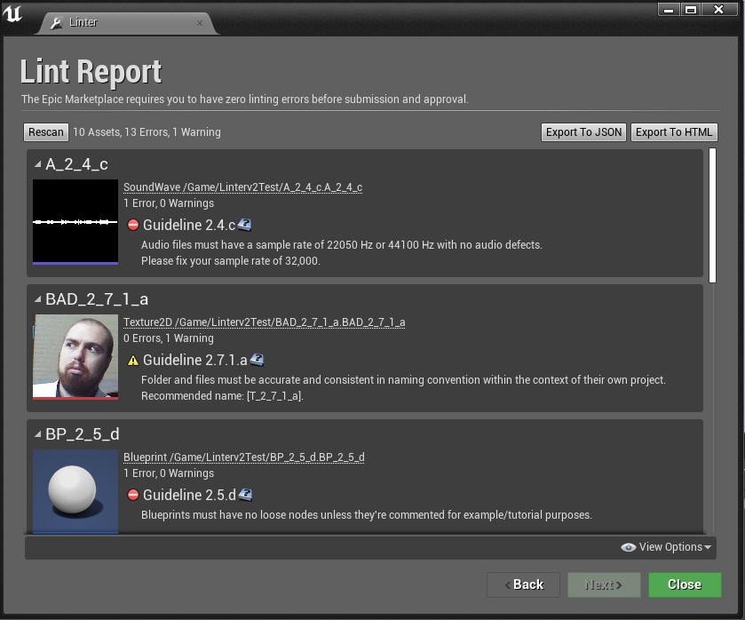

# Getting Started

## Requirements

* You will need a launcher version of Unreal Engine 4 version 4.24 or later.
* You must purchase (for free) the Linter plugin on the Unreal Engine Marketplace. @TODO: Add link here once I have it

## Installing From The Launcher

1. Close all your instances of Unreal Engine 4
2. Using the Epic Launcher find Linter in your Vault
3. Use the Install to Engine button to install Linter to your Engine

## Enabling Linter

1. Open your project
2. Open the Plugins window by clicking Windows on the main toolbar and navigating to Plugins
3. @TODO: My launcher is installing, finish writing this as soon as it is done
4. Enable the Linter plugin by ensuring the Enabled checkbox is checked
5. Restart the editor

## Using Linter

Once installed there isn't much in the way of using Linter. Operating Linter is pretty straightforward:

1. Right-click on a content folder in your project
2. Click "Scan with Linter"
3. Select the ruleset you would like to use for linting
4. Wait for the results

## The Lint Report

Once a project is scanned, you will be presented with a Lint Report that provides an overall summary of the state of your project.

