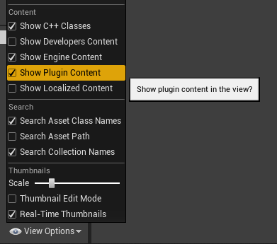
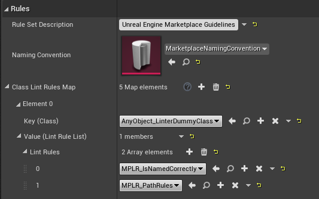
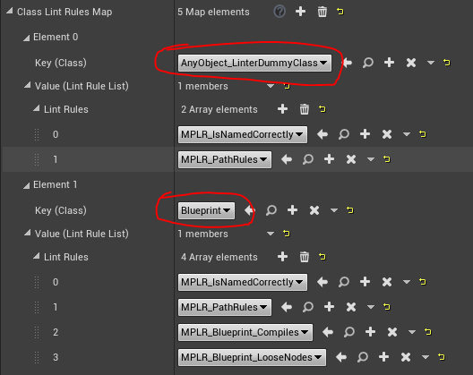
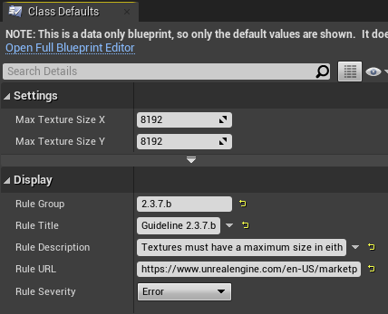

# How Does Linting Work?

Linter's bundled rulesets are included in the Linter Plugin content folder. Engine and Project plugin folders might be hidden in your engine. To show them, make sure the checkboxes next to Show Engine Content and Show Plugin Content are both checked in your Content Browser's View Options.



## Dissecting a Linter Rule Set


Linters are defined by `LintRuleSets`, essentially a fancy [Data Asset](https://www.youtube.com/watch?v=gLWXZ3FXhO8). In the above example, we are looking at the `MarketplaceLintRuleSet` asset which defines all of the rules we want to use when scanning for marketplace guideline compliance.



In the above image you'll see that this `LintRuleSet` uses a `NamingConvention` Data Asset named `MarketplaceNamingConvention` In addition to a NamingConvention asset, `LintRuleSet` assets also contain something called a Class Lint Rules Map. This is a map of Unreal Engine 4 classes paired with a list of `LintRules`, which are assets that make up individual rules that we'll cover later.



When objects in an Unreal Engine 4 project are linted, they are scanned using the rules that match the "most specific" class defined in the Class Lint Rules Map. You can use any class in this map, with the base `UObject` being a special case.

Unfortunately at this time the Unreal Engine 4 editor does not allow `UObject` as a valid value as a key in this Class Lint Rules Map, so if you want to define rules that you want to scan `UObjects` with, please use the `AnyObject_LinterDummyClass` class instead.

With the above example ruleset, when the Linter comes across a `UBlueprint` asset it will scan that asset using the four lint rules defined above. This is because `UBlueprint` is a more specific class definition than `UObject`. Another asset type, such as a data asset, will instead use the `AnyObject_LinterDummyClass` rules when being scanned unless there is a more specific matching class defined in the ruleset than `UObject`.

**NOTE:** Currently there isn't support for allowing cascading rule checks, i.e. allowing a `UBlueprint` being scanned against rules paired with `UBlueprint` *as well as* `UObject`. This support is planned to be added in a future release. See [todo](/todo).

## How Lint Rules Are Implemented

While `LintRules` can be implemented in both Blueprint and C++, currently there aren't too many functions exposed to Blueprint that deal with asset metadata and lower level asset management checks and tasks. It is currently strongly recommended that you do your rule checking logic in C++ and then only expose configuration settings to a Blueprint class.

All of Linter's bundled `LintRules` are Blueprint child classes that parent from a native C++ `LintRule`, with the goal that the Blueprint `LintRules` only expose configuration options.

### PassesRule_Internal_Implementation

The core of implementing your own `LintRule` is to implement the `PassesRule_Internal_Implementation` function. This function can be implemented in either C++ or Blueprint as this is a `BlueprintNativeEvent`. 

This should be where the business logic of your `LintRule` operates. To report a rule violation, push a new `FLintRuleViolation` to the `OutRuleViolations` array and return false. You should always return false if **any** rule is violated and you should always return true if **no** rules were violated. A `FLintRuleViolation` is simply a struct that has a reference to the asset that is violating the rule, a reference to the rule that is being violated, and potentially any additional optional recommended text to display to the user reading the Lint Report.

Implementing this function is all you need for your `LintRule` to be functional and ready for use. For the sake of example, here is how the Unreal Engine Marketplace Guideline rule for ensuring your textures are not too big is implemented:

```cpp
bool ULintRule_Texture_Size_NotTooBig::PassesRule_Internal_Implementation(UObject* ObjectToLint, const ULintRuleSet* ParentRuleSet, TArray<FLintRuleViolation>& OutRuleViolations) const
{
	const UTexture2D* Texture = CastChecked<UTexture2D>(ObjectToLint);

	int32 TexSizeX = Texture->GetSizeX();
	int32 TexSizeY = Texture->GetSizeY();

	// Check to see if textures are too big
	if (TexSizeX > MaxTextureSizeX || TexSizeY > MaxTextureSizeY)
	{
		FText RecommendedAction = NSLOCTEXT("Linter", "LintRule_Texture_Size_NotTooBig_TooBig", "Please shrink your textures dimensions so that they fit within {0}x{1} pixels.");
		OutRuleViolations.Push(FLintRuleViolation(ObjectToLint, GetClass(), FText::FormatOrdered(RecommendedAction, MaxTextureSizeX, MaxTextureSizeY)));
		return false;
	}

	return true;
}
```

In the above code, we simply check to see if the `ObjectToLint` is a texture with width or height exceeding a `MaxTextureSizeX/MaxTextureSizeY`, which is defined in our Blueprint child as `8192`. This allows us to easily scan for textures that are bigger than 8k. If we ever want to decrease or increase the size of our textures allowed under this rule, we can easily do so by editing the `MaxTextureSizeX/MaxTextureSizeY` in Blueprint without requiring any code changes or code compiling.

It is recommended that you create a Blueprint child of your native classes to fill out the Rule's display info. This way the rule can also have verbiage updates without requiring code edits.



### PassesRule Is Most Likely Not What You Want

`LintRules` also have a virtual function called `PassesRule`. This is not meant for containing the business logic of your `LintRule`. This is a public `BlueprintCallable` function that allows your `LintRule` to have a Blueprint implementation of `PassesRule_Internal_Implementation`.

You should only implement this if you want to "early out" of the linting process. Linter's strategy is to try to implement error handling in `PassesRule` for things like possible null checks or invalid objects and then only performing the actual scan logic inside `PassesRule_Internal_Implementation`. You **do not** need to implement your own `PassesRule`.

### IsRuleSuppressed is optional

`LintRules` can also be programmatically suppressed by implementing the `IsRuleSuppressed` function. This function is called automatically by the base `PassesRule` implementation. If you want to simply suppress a rule, do so here instead of `PassesRule`.

## How Lint Naming Conventions Are Implemented

`NamingConvention` assets are simply a list of naming conventions as a data asset. `LintRules` will have access to the `NamingConvention` data asset that is defined in the lint rule's parent `LintRuleSet`. The `NamingConvention` data asset isn't responsible for any implementation logic. Instead `LintRules` are written to perform these naming convention checks using the given `NamingConvention` data asset as configuration. 

## LintRuleCollections... collect rules

Sometimes it is easier to treat a collection of rules as a single rule. In this case, you can create a `LintRuleCollection` class that simply defines a list of other `LintRules`. This is very useful when dealing with repetitive path and file name lint rules.

## Video Walkthrough of Creating A LintRuleSet

@TODO: Get this edited, uploaded, submitted, embedded

## Automated Linting via Commandlets

The Linter plugin adds a Commandlet that you can run against your project via commandline. It will return an error code of 1 if the linting process fails for any reason. It will return an error code of 2 if Linter reports any errors, or warnings as well if `-TreatWarningsAsErrors` is passed on the commandline.

To invoke the commandlet, run your Editor binary (i.e. `D:\UE424\Engine\Binaries\Win64\UE4Editor-Cmd.exe`), followed by the path to your `.uproject` (i.e. `"C:\Users\Allar\Documents\Unreal Projects\Linterv2Test\Linterv2Test.uproject"`), followed by the arg `-run=Linter`.

Full command for example, `D:\UE424\Engine\Binaries\Win64\UE4Editor-Cmd.exe "C:\Users\Allar\Documents\Unreal Projects\Linterv2Test\Linterv2Test.uproject" -run=Linter`.

This will run Linter against the `/Game` path, a.k.a. your project's path, and return error code 0 if there are no errors.

### Additional Args

#### Content Paths

You can tell Linter to scan a list of folders to scan. They should generally be in the UE4 path form of `/Game/Content/...`. If a path includes spaces, wrap it in quotes.

For example, if you only wanted to scan folders `Apple` and `Orange Stuff` inside your project's `Content` folder...

`D:\UE424\Engine\Binaries\Win64\UE4Editor-Cmd.exe "C:\Users\Allar\Documents\Unreal Projects\Linterv2Test\Linterv2Test.uproject" /Game/Content/Apple "/Game/Content/Orange Stuff" -run=Linter`.

This will scan both the `Apple` and `Orange Stuff` folders inside your project's `Content` folder. You can also pass in `Engine` and plugin folders. If no path is provided, the default will always be `/Game`.

#### JSON Report

To generate a `.json` report, you can add the switch `-json` to generate a `.json` report in your project's `Saved/LintReports/` folder. You can override the name of the report via `-json=ReportName.json`. If you specify a relative path it will be relative to the `Saved/LintReports/` folder. You can also provide an absolute path to write the `.json` report to.

#### HTML Report

To generate a `.html` report, you can add the switch `-html` to generate a `.html` report in your project's `Saved/LintReports/` folder. You can override the name of the report via `-html=ReportName.html`. If you specify a relative path it will be relative to the `Saved/LintReports/` folder. You can also provide an absolute path to write the `.html` report to.

#### TreatWarningsAsErrors

If you use the `-TreatWarningsAsErrors` switch, Linter will return an error code of 2 if the report contains any warnings. By default, Linter only returns an error code if it fails to lint or if the lint report contains errors.